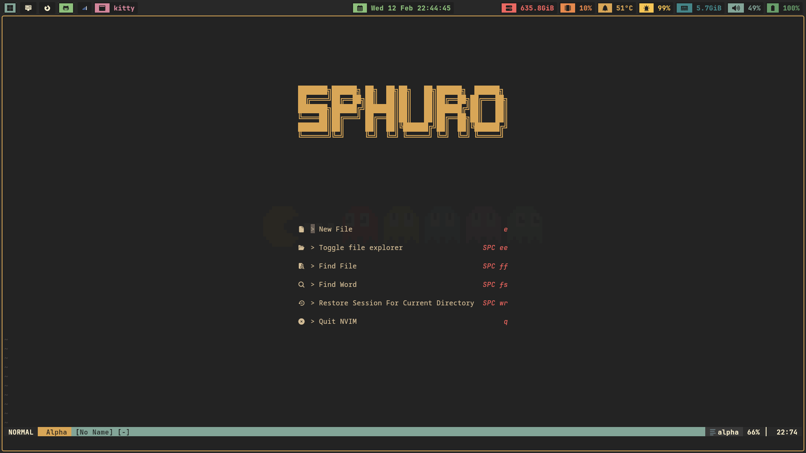
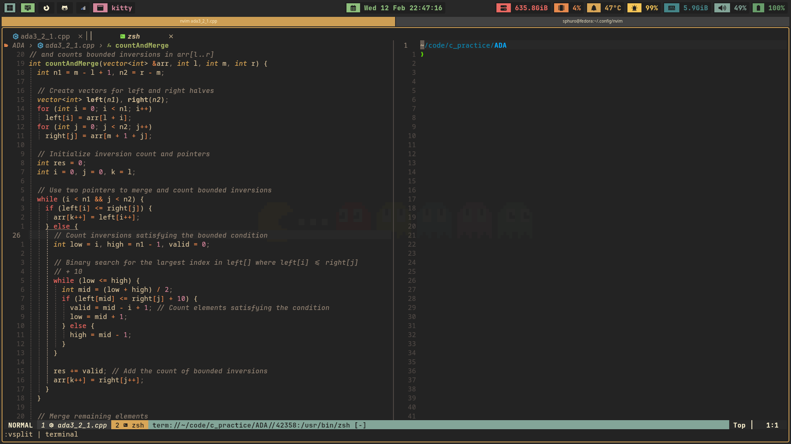
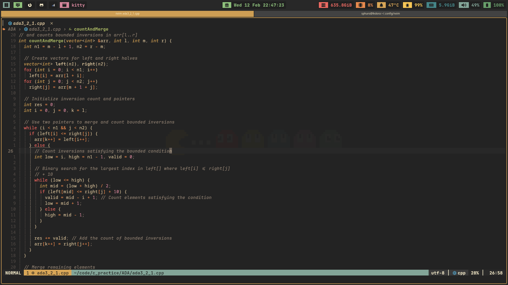

# Sphuro

- My neovim dotfiles.(Still in progress)

## Keybindings Configuration

### Keybindings

Below is a table of custom keybindings and their descriptions:

#### General Keybindings

| Keybinding   | Mode   | Description                                    |
| ------------ | ------ | ---------------------------------------------- |
| `<leader>nh` | Normal | Clear search highlights                        |
| `<leader>+`  | Normal | Increment number                               |
| `<leader>-`  | Normal | Decrement number                               |
| `jk` or `kj` | Insert | Exit insert mode                               |
| `x`          | Normal | Delete a character without copying to register |

#### Buffer Management

| Keybinding | Mode   | Description     |
| ---------- | ------ | --------------- |
| `[b`       | Normal | Previous buffer |
| `]b`       | Normal | Next buffer     |

#### Window Management

| Keybinding   | Mode   | Description               |
| ------------ | ------ | ------------------------- |
| `<leader>sv` | Normal | Split window vertically   |
| `<leader>sh` | Normal | Split window horizontally |
| `<leader>se` | Normal | Equalize window size      |
| `<leader>sx` | Normal | Close current split       |

#### Tab Management

| Keybinding   | Mode   | Description                    |
| ------------ | ------ | ------------------------------ |
| `<leader>to` | Normal | Open new tab                   |
| `<leader>tx` | Normal | Close current tab              |
| `<leader>tn` | Normal | Go to next tab                 |
| `<leader>tp` | Normal | Go to previous tab             |
| `<leader>tf` | Normal | Open current buffer in new tab |

#### Code Execution

| Keybinding   | Mode   | Description         |
| ------------ | ------ | ------------------- |
| `<leader>rp` | Normal | Run Python script   |
| `<leader>xu` | Normal | Compile and run C++ |
| `<leader>xc` | Normal | Compile and run C   |

#### Plugin-Specific Keybindings

##### Nvim-Tree (File Explorer)

| Keybinding   | Mode   | Description                          |
| ------------ | ------ | ------------------------------------ |
| `<leader>ee` | Normal | Toggle file explorer                 |
| `<leader>ef` | Normal | Toggle file explorer on current file |
| `<leader>ec` | Normal | Collapse file explorer               |
| `<leader>er` | Normal | Refresh file explorer                |

##### Telescope (File and String Searching)

| Keybinding   | Mode   | Description                      |
| ------------ | ------ | -------------------------------- |
| `<leader>ff` | Normal | Find files                       |
| `<leader>fr` | Normal | Find recent files                |
| `<leader>fs` | Normal | Find string in current directory |
| `<leader>fc` | Normal | Find string under cursor         |
| `<leader>ft` | Normal | Find TODOs                       |

##### Code Formatting

| Keybinding   | Mode   | Description |
| ------------ | ------ | ----------- |
| `<leader>fm` | Normal | Format code |

##### Competitive Programming (CompetiTest Plugin)

| Keybinding | Mode   | Description     |
| ---------- | ------ | --------------- |
| `<C-b>`    | Normal | Run CompetiTest |
| `<C-t>`    | Normal | Receive problem |
| `<C-m>`    | Normal | Add test case   |

#### Terminal Mode

| Keybinding   | Mode     | Description                     |
| ------------ | -------- | ------------------------------- |
| `<Esc>`      | Terminal | Exit terminal mode              |
| `jk`         | Terminal | Exit terminal mode              |
| `<leader>te` | Normal   | Open terminal in vertical split |

### License

This configuration is open-source and available for personal and professional use.

---

Enjoy coding with enhanced Neovim functionality!
